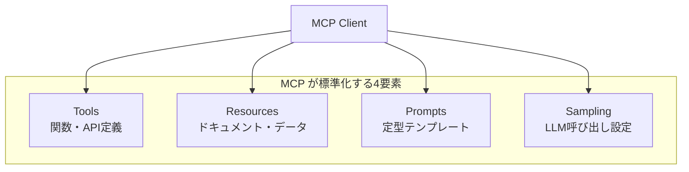
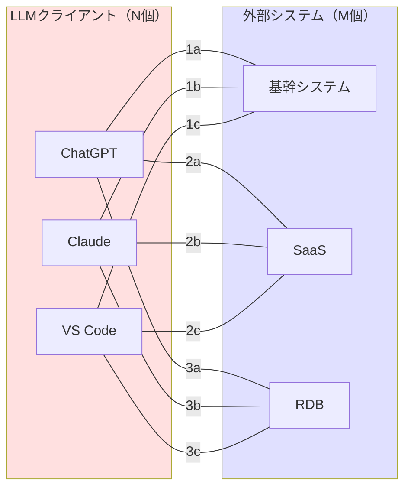
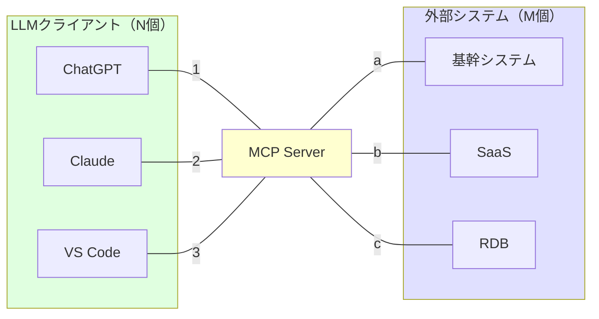
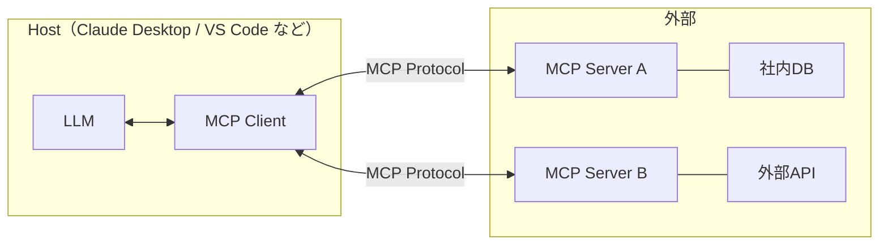
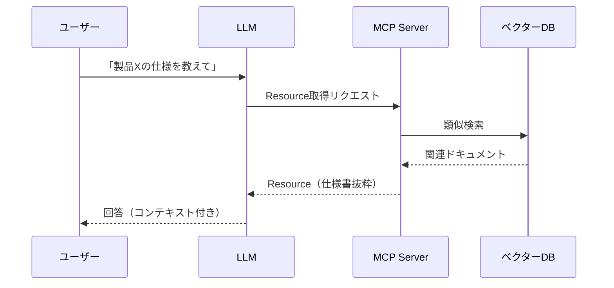
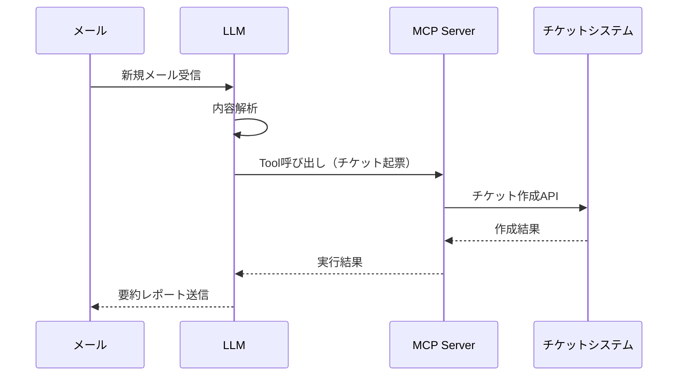
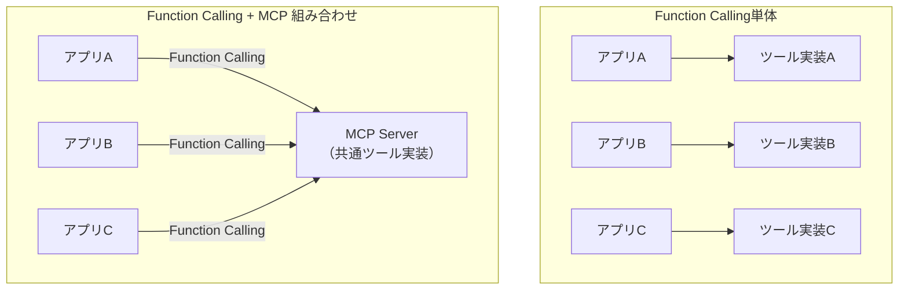

# 1. 概要

この章では、Model Context Protocol（MCP）の全体像をつかみます。  
「MCP ってそもそも何？」というレベルから、「どのような場面で役立つのか」「既存の仕組みと何が違うのか」までを整理します。

---

## 1.1 Model Context Protocol（MCP）とは

### 1.1.1 一言でいうと

**MCP（Model Context Protocol）は、LLM と外部システムを“標準的な形”でつなぐためのプロトコル**です。

- LLM（ChatGPT や Claude など）が  
  - 社内システムのデータを読んだり  
  - API を呼び出したり  
  - ファイルを生成・取得したり  
するための「共通インターフェース」を定義したものと考えるとイメージしやすいです。

### 1.1.2 何を標準化しているのか

MCP が扱うのは主に次のような要素です。

- **ツール（Tools）**
  - モデルから呼び出せる「関数」「API」の一覧と、そのパラメータ定義
- **リソース（Resources）**
  - モデルに渡すドキュメントやデータ、RAG 用のテキストなど
- **プロンプト（Prompts）**
  - モデルに投げる定型プロンプトのテンプレート
- **サンプリング（Sampling）**
  - 「どのモデルを、どんなパラメータで呼ぶか」といった LLM 呼び出し自体の標準化

ポイントは、 **「どの LLM クライアントからも、同じ MCP サーバーに対して共通のやり方でアクセスできる」**ことです。

---

## 1.2 なぜ MCP が必要か（N×M 問題と背景）

### 1.2.1 N×M 問題とは

生成 AI を本格的に業務活用しようとすると、次のような組み合わせ爆発が起きます。

- LLM クライアント側：  
  - ChatGPT、Claude、VS Code プラグイン、ブラウザ拡張、社内独自UI… → **N 個**
- 社内・社外システム側：  
  - 基幹システム、SaaS、オンプレAPI、RDB、ファイルサーバー… → **M 個**

個別連携をすると、

> 「クライアント N 個 × システム M 個」の組み合わせ分だけ実装・保守が発生する

という **N×M 問題** になります。

**N×M = 9本の連携が必要（3クライアント × 3システム）**

### 1.2.2 MCP で何が解消されるか

MCP を導入すると構造が次のように変わります。

- LLM クライアント側は **「MCP クライアント」** として振る舞う
- 社内・社外システムは **「MCP サーバー」** を 1 つ用意し、その中にツールやリソースを定義する

**N+M = 6本の連携で済む（3クライアント + 3システム）**

結果として、

- **クライアントは「MCP に対応してさえいれば」社内システムを利用できる**
- **サーバー側は「MCP サーバーを 1 回用意すれば」複数クライアントから共通利用できる**

という形になり、設計・実装・運用のコストが大きく下がります。

---

## 1.3 基本コンセプトと用語

### 1.3.1 Host / Client / Server

MCP では次の 3 者が登場します。

- **Host（ホスト）**
  - 実行環境を提供する側
  - 例：ChatGPT や Claude Desktop、VS Code の拡張機能など
- **Client（クライアント）**
  - ホストの中で「MCP サーバーと話す役」を担うコンポーネント
  - サーバーに接続し、ツール一覧やリソースを取得する
- **Server（サーバー）**
  - 実際にツールやリソースを提供する側
  - 社内システムや外部サービスとつながっている実装本体

ざっくりまとめると、

> 「ホストの中で動いている MCP クライアントが、外部の MCP サーバーと会話する」

という構造になります。

### 1.3.2 コンテキスト / ツール / リソース / プロンプト

MCP で頻出する用語を整理しておきます。

- **コンテキスト（Context）**  
  - モデルが推論するための「前提情報」のかたまり  
  - 会話履歴・システムプロンプト・リソースから読み込んだテキストなど
- **ツール（Tools）**  
  - 「モデルから呼び出せる関数」  
  - REST API のラッパー、DB クエリ実行、ファイル操作、業務ワークフロー起動など
- **リソース（Resources）**  
  - モデルに渡すドキュメントやデータ  
  - 例：  
    - 社内ナレッジの文章  
    - チケットの内容  
    - 設計書やマニュアルの一部
- **プロンプト（Prompts）**  
  - よく使う指示文をテンプレート化したもの  
  - 例：  
    - 「このチケットの内容を要約して、担当者と期限を抽出して」  
    - 「エラーの原因候補を 3 つ挙げ、各対処方針を書いて」

---

## 1.4 主な利用シーン

### 1.4.1 RAG・検索・社内ナレッジとの連携

- 社内ドキュメントを RAG 用のベクターストアに格納し、MCP の Resource として公開
- LLM から「製品 X の仕様書」や「手順書」の該当部分を取得して回答に組み込む

MCP を使うことで、
- 「どのクライアントからも同じナレッジ基盤を利用できる」
- 「ナレッジ側の実装変更を MCP サーバー側に閉じ込められる」

というメリットがあります。

### 1.4.2 自動化ワークフロー構築

- 「メール受信 → MCP ツールでチケット起票 → 結果を要約して報告」
- 「定期バッチのログを取得 → 異常値の有無をモデルに判定させる」

といった、一連の業務プロセスの一部として MCP ツールを組み込むイメージです。

---

## 1.5 他方式との比較

### 1.5.1 独自 API 連携との違い

**独自 API 連携**

- 各クライアントが、各システムと直接 HTTP API などで連携
- クライアントごとに  
  - エンドポイント  
  - 認証方式  
  - スキーマ  
  を個別に実装・保守する必要がある

**MCP の場合**

- MCP サーバーが API の違いを吸収し、「ツール」として公開
- クライアントは MCP の共通プロトコルさえ理解していればよい

→ **「クライアント側の実装を薄くし、サーバーに集約する」** 発想です。

### 1.5.2 OpenAI の Function Calling との関係

- Function Calling は「特定のモデル（API）に対して、ツール呼び出しを定義する仕組み」
- MCP は「**モデルの外側に独立したサーバーを置き、複数クライアントから共通利用するためのプロトコル**」

という位置づけの違いがあります。

- Function Calling
  - モデルが「この関数を呼びたい」と返してきて、アプリ側が実行する
  - 実装はアプリケーションごとにバラバラになりがち
- MCP
  - ツール一覧／実行方法／リソース取得を **MCP サーバー** に閉じ込める
  - 「どのクライアントからも同じツール群を使える」形に整理する

両者は競合というより、

> アプリ側では MCP サーバーを実装し、
> モデル側では Function Calling で MCP ツールを呼ぶ

といった **組み合わせ** で利用されることも想定できます。

---

## 1.6 この章のまとめ

- MCP は **「LLM と外部システムをつなぐための標準プロトコル」** である  
- N×M 問題（クライアント × システムの組み合わせ爆発）を緩和し、  
  実装・運用を「MCP サーバー」に集約できる  
- ツール・リソース・プロンプトなどを共通形式で扱うことで、  
  複数のクライアントから同じ機能群を再利用できる  
- Function Calling とは役割のレイヤーが異なり、  
  組み合わせて使うことでより強力なアーキテクチャを構成できる  

次の章では、この概要で触れた概念を、**JSON-RPC を使った具体的なプロトコル仕様とアーキテクチャ**の観点から掘り下げていきます。
