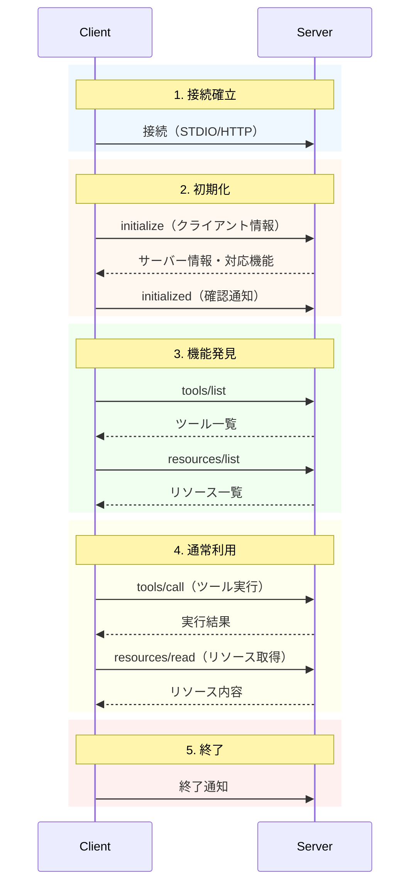
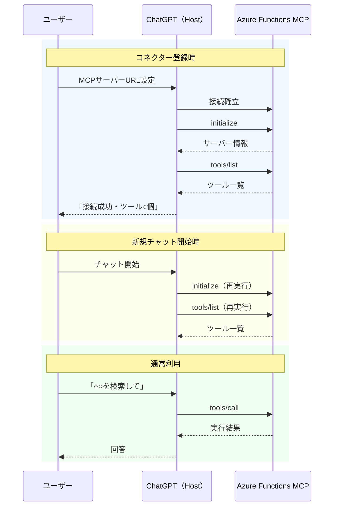
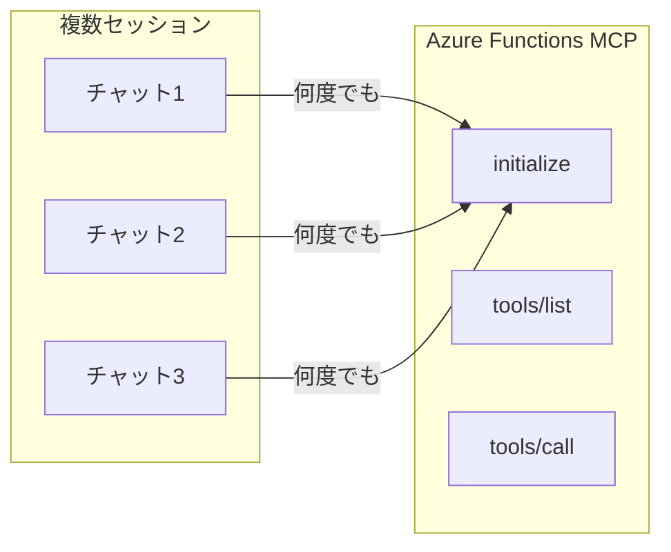
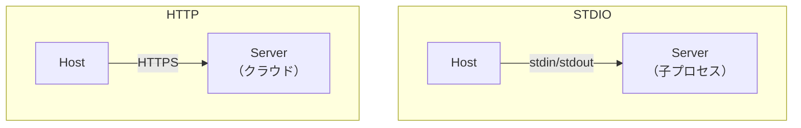
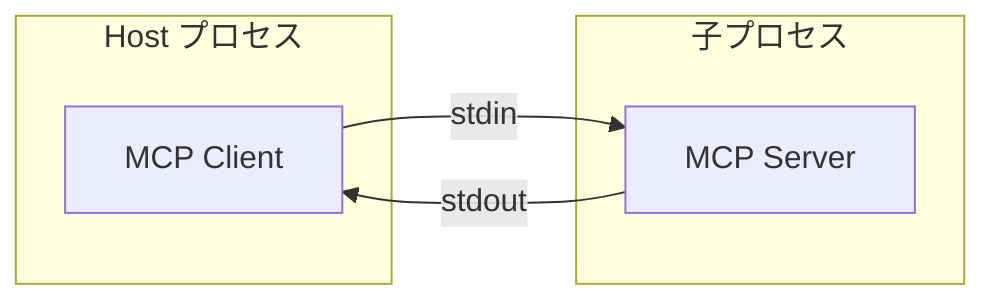
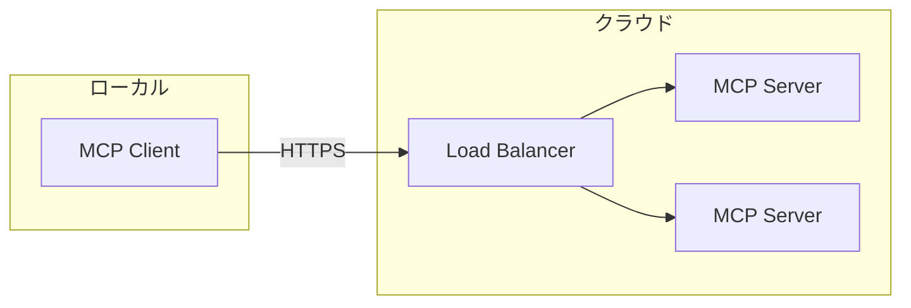

# 2. 技術仕様

この章では、MCP の「中身の動き」を実装寄りの視点で整理します。
Host/Client/Serverの基本概念は[1章](01_概要.md)を参照してください。

---

## 2.1 通信プロトコル：JSON-RPC 2.0

MCPは **JSON-RPC 2.0** をベースにしたプロトコルです。

### 2.1.1 JSON-RPC 2.0 とは

JSON-RPC 2.0 は、JSON を利用した軽量なリモート手続き呼び出し（RPC: Remote Procedure Call）の通信ルール（プロトコル）です。
ネットワーク越しにメソッドを呼び出し、その結果を受け取るための メッセージ形式のルール を定めています。

**リクエスト構造**

```json
{
  "jsonrpc": "2.0",
  "id": 1,
  "method": "tools/list",
  "params": {}
}
```

| フィールド | 説明 |
|-----------|------|
| `jsonrpc` | 必ず `"2.0"` |
| `id` | リクエスト識別子（レスポンスと対応） |
| `method` | 呼び出すメソッド名 |
| `params` | メソッドごとのパラメータ |

**レスポンス構造（成功時）**

```json
{
  "jsonrpc": "2.0",
  "id": 1,
  "result": {
    "tools": [
      { "name": "getTicket", "description": "チケット情報を取得", "inputSchema": { } }
    ]
  }
}
```

**レスポンス構造（エラー時）**

```json
{
  "jsonrpc": "2.0",
  "id": 1,
  "error": {
    "code": -32600,
    "message": "Invalid Request",
    "data": { "details": "..." }
  }
}
```

### 2.1.2 MCPで使用する主なメソッド

| メソッド | 説明 | 方向 |
|----------|------|------|
| `initialize` | セッション開始・機能ネゴシエーション | Client→Server |
| `tools/list` | 利用可能なツール一覧を取得 | Client→Server |
| `tools/call` | ツールを実行 | Client→Server |
| `resources/list` | 利用可能なリソース一覧を取得 | Client→Server |
| `resources/read` | リソース内容を取得 | Client→Server |
| `prompts/list` | 利用可能なプロンプト一覧を取得 | Client→Server |
| `prompts/get` | プロンプトテンプレートを取得 | Client→Server |
| `sampling/createMessage` | LLM呼び出しを依頼 | Server→Client |

---

## 2.2 セッションライフサイクル

### 2.2.1 全体フロー



### 2.2.2 各フェーズの詳細

| フェーズ | 目的 | 実装者が意識すること |
|----------|------|---------------------|
| **接続確立** | 通信経路の確保 | トランスポート選択（STDIO/HTTP） |
| **初期化** | 機能ネゴシエーション | サポート機能の宣言 |
| **機能発見** | 利用可能な機能の把握 | ツール/リソース一覧の正確な返却 |
| **通常利用** | 実際の処理実行 | エラーハンドリング |
| **終了** | リソース解放 | 接続のクリーンアップ |

### 2.2.3 ユーザー体験との対応（ChatGPT + Azure Functions の例）

「接続確立→初期化→機能発見」は**ユーザーから見ると裏側で起きている**。



| タイミング | 実行されるフェーズ | ユーザーに見える現象 |
|-----------|-------------------|---------------------|
| コネクター登録時 | 接続→初期化→機能発見 | 「接続成功」「ツール一覧表示」 |
| 新規チャット開始時 | 初期化→機能発見（再実行） | 特に見えない（裏で実行） |
| プロンプト送信時 | 通常利用（tools/call等） | 「ツールを使用中...」 |

### 2.2.4 サーバー実装の原則：ステートレス設計

**重要**: 各チャットセッションは独立したMCPセッションとみなす。



| 設計原則 | 理由 |
|---------|------|
| `initialize`/`tools/list`は何度呼ばれてもOK | 新規チャットごとに再実行される |
| セッション状態をメモリに持たない | サーバーレスはインスタンスが消える前提 |
| 状態が必要なら外部ストレージに保存 | Cosmos DB、Table Storage等 |

---

## 2.3 トランスポート（通信方式）

MCPのJSON-RPCメッセージを「どう運ぶか」は複数の選択肢があります。

### 2.3.1 3つのトランスポート比較



| 方式 | 仕組み | 向いているケース |
|------|--------|-----------------|
| **STDIO** | 標準入出力で通信 | ローカル開発、機密データ |
| **HTTP** | HTTPリクエスト/レスポンス | クラウド運用、共有利用 |


### 2.3.2 STDIO



**特徴**
- ネットワーク設定不要
- Host がサーバーのライフサイクルを管理
- ローカル PC 内で完結

**適用例**
- Claude Desktop + ローカルMCPサーバー
- 開発環境でのテスト
- 機密データを扱う場合

### 2.3.3 HTTP



**特徴**
- 既存インフラ（認証、LB等）と統合しやすい
- 複数ユーザーで共有可能
- ネットワーク設計が必要

**適用例**
- Azure Functions / Cloud Run 上のMCPサーバー
- 組織共通のツール提供
- SaaS連携

---

## 2.4 この章のまとめ

| 項目 | ポイント |
|------|---------|
| **プロトコル** | JSON-RPC 2.0ベース |
| **ライフサイクル** | 接続→初期化→発見→利用→終了 |
| **トランスポート** | 用途に応じてSTDIO/HTTPを選択 |
| **サーバー設計** | ステートレス、何度呼ばれてもOKな実装 |