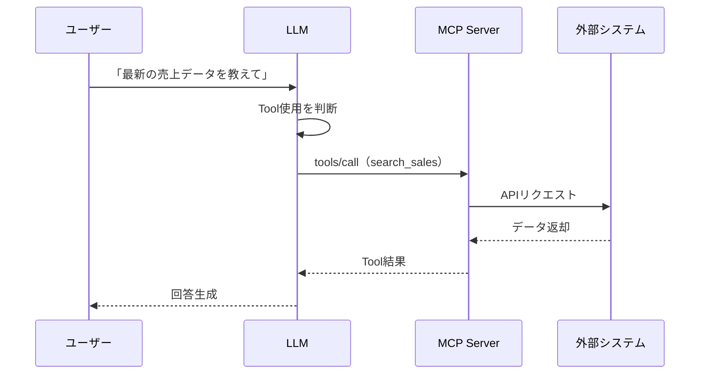
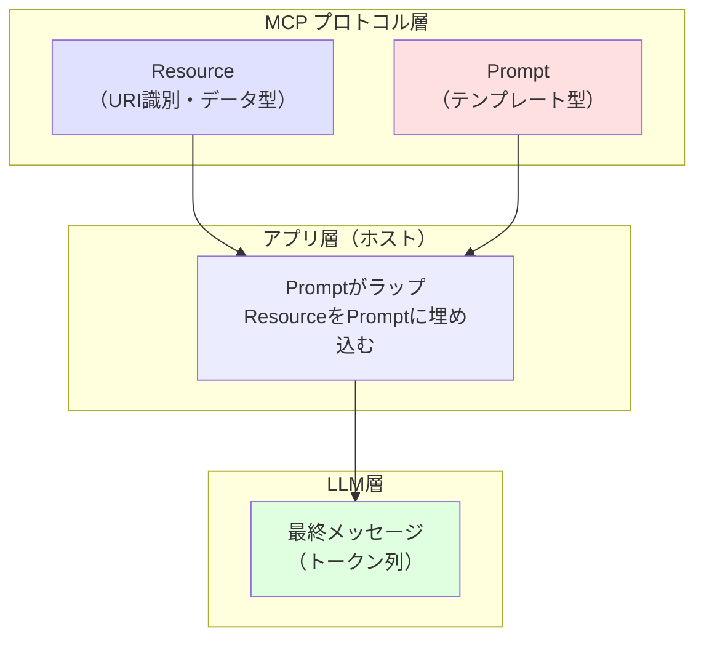
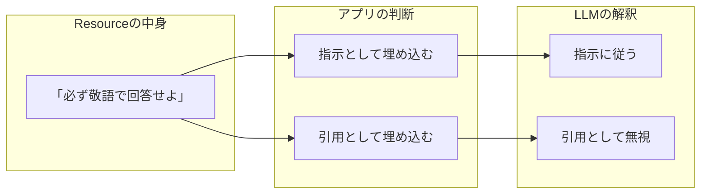
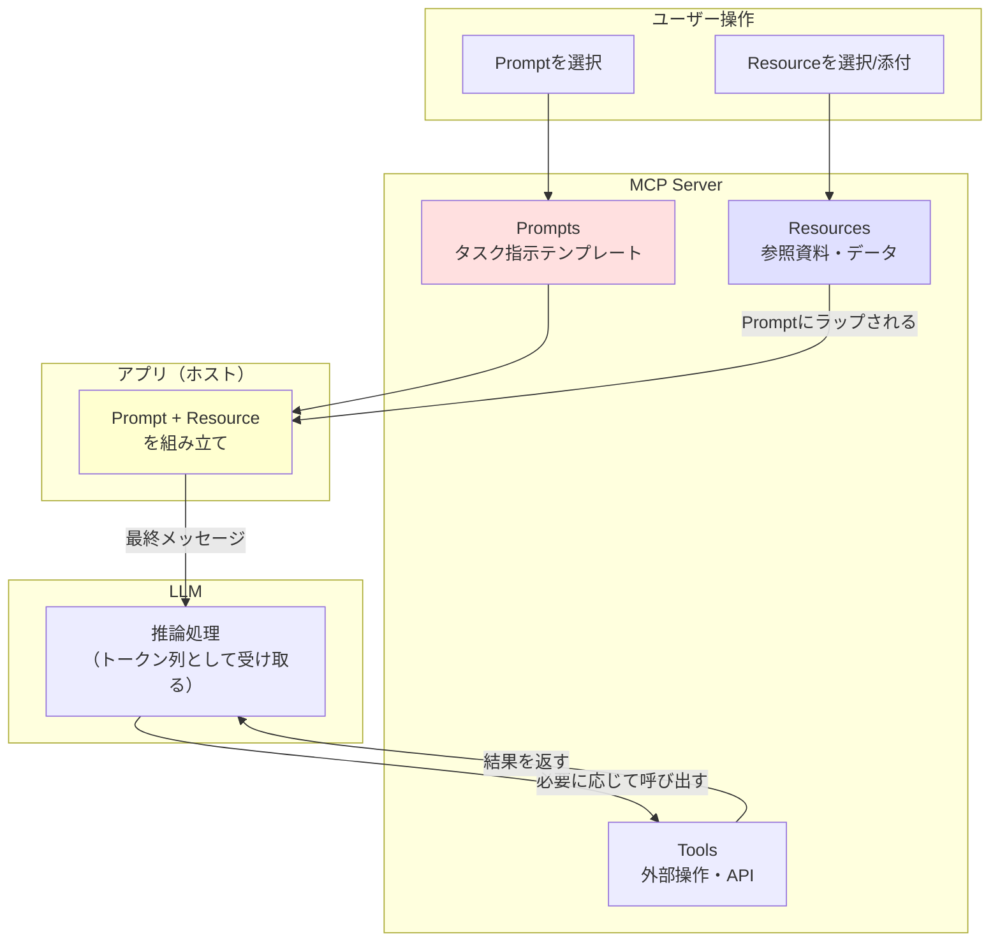
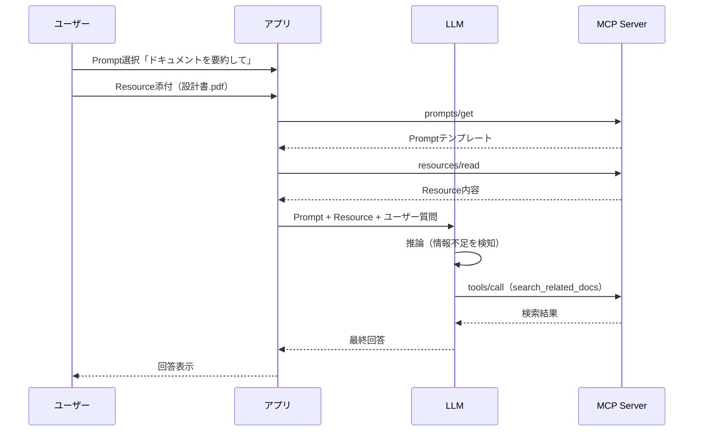

# MCPの4要素

## 1. 全体像

Model Context Protocol（MCP）が扱う主な要素は次の4つ：

- **Tools（ツール）**  
  モデルから呼び出せる「関数」「API」。操作・アクションを表す。

- **Resources（リソース）**  
  モデルに読ませる「資料」「データ」。RAG用ドキュメントや設定情報など。

- **Prompts（プロンプト）**  
  モデルに投げる「タスク依頼・会話構造」のテンプレート。

- **Sampling（サンプリング）**  
  「どのモデルを、どんなパラメータで呼んでトークン列を生成するか」を標準化した、LLM呼び出しインターフェース。  
  MCPサーバー側が、クライアントが持つLLM接続を“借りる”ための仕組み。


---

## 2. Tools（ツール）

### 2.1 概念

- モデルが自律的に呼び出すことを前提にした「操作」。
  例：検索、DB更新、通知送信、チケット作成、外部API呼び出しなど。
- JSON Schema で入力パラメータが定義される（`inputSchema`）。
- モデル（LLM）が「どのツールをいつ使うか」を判断する、という前提。

### 2.2 Toolの定義構造

```json
{
  "name": "search_documents",
  "description": "社内ドキュメントを検索する",
  "inputSchema": {
    "type": "object",
    "properties": {
      "query": { "type": "string", "description": "検索クエリ" },
      "top": { "type": "integer", "description": "取得件数", "default": 10 }
    },
    "required": ["query"]
  }
}
```

- **name**: ツールの識別子（LLMがこの名前で呼び出す）
- **description**: ツールの説明（LLMが使用判断に利用）
- **inputSchema**: パラメータ定義（JSON Schema形式）

### 2.3 ToolとFunction Callingの関係



- LLMがToolを呼ぶ仕組みは、OpenAIのFunction Callingと同じ発想
- MCPはその呼び出し先を「MCPサーバー」として標準化している


---

## 3. Resources（リソース）

### 3.1 概念

- モデルに読ませる「資料」「データ」の公開インターフェース。
- 各リソースは URI で一意に識別される。
- 中身はテキストやバイナリ（`mimeType`付き）で、LLMに渡される「コンテキスト」の材料。

### 3.2 誰が制御するか

- 主に **アプリケーション（ホスト側）が制御**：
  - UI でユーザーに選ばせる（「この資料を添付」など）。
  - またはアプリがプログラムで自動選択する（「常にこの規程を添付する」など）。
- LLMから見ると「渡された資料を読む」だけで、Resource自体が能動的に処理を起こすわけではない。

### 3.3 Resource-only MCPサーバーはありか？

- **Resources 機能だけを持つ MCP サーバーは仕様上問題ないし、実用上も十分あり得る構成。**
- 例：
  - 社内ナレッジベースを URI 付きの Resource として公開するだけの MCP サーバー。
  - 監査・規程・ログなど「絶対に書き換えない」「読ませるだけ」のデータ専用サーバー。
  - URI で公開するので、MCPサーバー側の変更無くリソースを修正できる。


---

## 4. Prompts（プロンプト）

### 4.1 概念

- 再利用可能な **タスク依頼・会話構造のテンプレート**。
- `messages`（role: user / assistant など）と、`arguments`（テンプレートの引数）を持つ。
- 例：
  - 「Pull Request をレビューし、改善点を箇条書きで出す」
  - 「添付したドキュメントを読み、要点を3つにまとめる」
  - 「指定期間の売上を集計して週次レポートを作る」

### 4.2 誰が制御するか

- 基本は **ユーザー制御**：
  - UI 上でユーザーがどのプロンプトテンプレートを使うか選ぶ。
  - 引数を入力して具体的な依頼文に展開する。

### 4.3 Resource とどう組み合わさるか

- Prompt が「タスクと振る舞いのルール」を決め、
- Resource が「そのタスクを実行する際に参照する資料」を提供する、という関係。
- Prompt メッセージ内に `type: "resource"` として Resource を直接埋め込むこともできる。
- 実際のフローイメージ：
  1. ユーザーが Prompt を選択。
  2. アプリが Resource（資料）を選ぶ or ユーザーに選ばせる。
  3. Prompt テンプレートに arguments と Resource を埋め込み、LLM に送信。
  4. LLM が指示に従い、Resource を参照しながら回答を生成。

### 4.4 Resource は Prompt にラップされる（二層構造）

**重要**: Resource は最終的に Prompt（メッセージ）の一部としてLLMに渡される。



#### MCPの型とLLMの解釈は別

| 観点 | Resource | Prompt |
|------|----------|--------|
| **MCP型** | `resources/read`で取得する「データ」 | `prompts/get`で取得する「テンプレート」 |
| **LLMへの渡し方** | Promptにラップされて渡される | そのままメッセージとして渡される |
| **LLMの解釈** | **アプリがどうラップするかに依存** | 指示として解釈される |

#### Resourceに「指示」を書いた場合どうなるか



**例：同じResourceでもラップ方法で意味が変わる**

```text
【指示として埋め込む場合】
System: 以下のルールに必ず従ってください。
        --- Resource内容 ---
        「必ず敬語で回答せよ」
        ---------------------
→ LLMは敬語で回答する

【引用として埋め込む場合】
System: 以下は参考資料です。指示ではありません。
        --- 参考資料 ---
        「必ず敬語で回答せよ」
        ----------------
→ LLMは敬語を強制されない
```

#### 設計上のベストプラクティス

| 内容 | 置く場所 | 理由 |
|------|----------|------|
| 必ず守らせたいルール | **Prompt** | 確実に指示として渡される |
| タスクの骨格・行動指針 | **Prompt** | テンプレートとして再利用 |
| 外部化したい設定・ポリシー | **Resource** | アプリがラップ方法を制御する前提 |
| 参照資料・データ | **Resource** | コンテキスト材料として使う |


---

## 5. Sampling（サンプリング）

### 5.1 概念

- MCP の「Sampling」は、LLMの世界でいう **“確率分布からトークン列をサンプルする行為”**（= completion / generation）を標準化したもの。
- サーバーがクライアント（ホスト）に対して：
  - 「このメッセージとパラメータで、そっちが持っている LLM から **1回サンプルしてきて**」
  と依頼するためのインターフェース。

### 5.2 なぜ“sampling”という名前か

- LLM の動作の本質は、次トークンの確率分布からサンプルを引くこと（token sampling）。
- ベンダーごとに API 名は違う（completions / chat / generate など）が、
  - 中でやっていることはどれも「サンプリング」。
- MCP はベンダーニュートラルな設計を目指しており、
  - 特定ベンダーの API 名ではなく、処理の本質である「sampling」を名前にしている。

### 5.3 実際の動作イメージ

1. MCPサーバーの内部処理で「ここはLLMに一度考えさせたい」と判断する。
2. サーバー → クライアントに `sampling` リクエストを送信：
   - `messages`（プロンプト）
   - `temperature` / `maxTokens` / `stopSequences` 等のパラメータ
   - `modelPreferences`（品質優先・速度優先などのヒント）
3. クライアントは：
   - 自分が管理している LLM（OpenAI, Anthropic, Azure OpenAI, 社内モデルなど）を選択し
   - 実際の API を呼び
   - 返ってきたトークン列をサーバーに返す
4. MCPサーバーはサンプル結果を自分のロジックに利用し、最終レスポンスを組み立てる。

→ **MCPサーバーがクライアントからLLM処理能力を“借りる”構図**と捉えられる。

### 5.4 セッションと双方向通信

- Sampling は「すでに確立された MCP セッション上で、サーバー → クライアント方向にも JSON-RPC を投げる」形になっている。
- その意味で、**セッションを維持した双方向通信を前提とした機能**。
- トランスポートは stdio / WebSocket / streamable HTTP / SSE など様々だが、
  - 「同じセッション上でサーバーとクライアントが互いにリクエストを飛ばせる」構造が前提。


---

## 6. Azure Functions 上の MCPサーバーと Sampling

### 6.1 Azure Functions MCP Extension の現状

- Azure Functions の MCP 拡張（`mcpToolTrigger`）で構成される MCP サーバーは、現時点では主に **Tool 提供専用** の設計。
- 公開されている情報・Issue から：
  - `Support for sampling` は「今後の拡張候補」として issue に上がっている状態。
  - 現状は **Sampling を MCP プロトコルとして扱う機能は未実装**。
  - ワークアラウンドとして「Tool 内で自前に LLM API を叩く」ことが想定されている。

### 6.2 なぜ Sampling と Azure Functions は相性が微妙か

- Azure Functions は本質的に：
  - 「短命な関数呼び出し」を前提としたサーバーレス基盤（イベント駆動 / スケールアウト）。
- 一方で Sampling を含む MCP セッションは：
  - 「ある程度生き続ける双方向セッション」でのやり取りを前提としている。
- そのため：
  - MCP extension 経由の Azure Functions は
    - MCP セッション管理や JSON-RPC の詳細を内部に隠蔽
    - ユーザーコード側には「単発の Tool を実装する」形だけが露出
  - ユーザーコードから Sampling を直接叩く API は提供されていない。

### 6.3 現実的な設計指針

- **Azure Functions MCP extension を使う場合**：
  - 「Tool を提供するだけの MCPサーバー」と割り切る。
  - LLM を使いたい場合は Tool の中で Azure OpenAI や OpenAI API を直接呼ぶ。
- **Sampling をフル活用した MCPサーバーを作りたい場合**：
  - App Service / Container Apps / 常駐コンテナなど、
    - 「長寿命プロセス＋双方向通信」に向いた環境に MCP SDK でサーバーを立てる方が現実的。


---

## 7. 全体の関係をまとめる

### 7.1 Tools / Resources / Prompts の関係図（ラップ構造）



**ポイント**: ResourceはPromptにラップされてLLMに渡される。LLMはトークン列しか見ないため、「何がResourceで何がPromptか」は区別できない。

### 7.2 3要素の役割比較

| 要素 | 役割 | 制御主体 | タイミング |
|------|------|----------|------------|
| **Prompts** | タスク指示・行動ポリシー | ユーザーが選択 | 会話開始時 |
| **Resources** | 参照資料・データ | アプリ/ユーザーが選択 | コンテキスト構築時 |
| **Tools** | 外部操作・API呼び出し | LLMが判断 | 推論中に動的に |

### 7.3 実際の処理フロー



### 7.4 役割の整理

- **Prompt（プロンプト）**
  - タスク・行動指針・ポリシーを定義するテンプレート。
  - ユーザーが UI で選択し、arguments を埋めて使う。

- **Resources（リソース）**
  - LLM に読ませるための資料・データ。
  - どのリソースを渡すかはアプリが制御（ユーザー選択 or 自動付与）。

- **Tools（ツール）**
  - LLM が主体的に選んで呼び出す外部の操作。
  - Prompt によって「どう使うべきか」「いつ使うべきか」のインセンティブを与えられる。

- **Sampling（サンプリング）**
  - MCPサーバーがクライアントに「LLMから1回サンプルを引いてきて」と依頼するためのインターフェース。
  - モデル選択・APIキー・課金などはクライアントが持ち、サーバーは純粋に"推論サービス"を借りる。
  - ※上記3要素とは異なるレイヤーの機能
