# Azure FunctionsでカスタムMCPサーバーを作成してClaudeに接続する

---

## 準備
1. `Azure Functions Core Tools` のインストール（未インストールのとき）
    ```bash
    # npm をインストールした状態でターミナル実行
    npm install -g azure-functions-core-tools@4
    ```
2. 拡張機能「Azure Functions」を入れる
    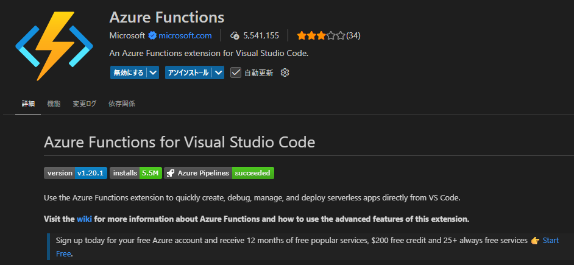

---

## 新しいプロジェクトを作る
- 新規プロジェクトを作りたい場所をVScodeで開く（作りたいフォルダのひとつ上の階層）
- 以下をターミナル実行
    ```bash
    func init <プロジェクト名>
    ```
    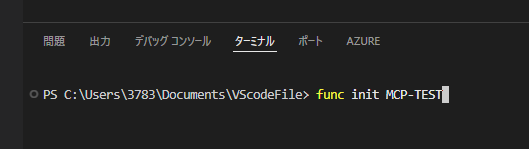
- Pythonを選ぶ
    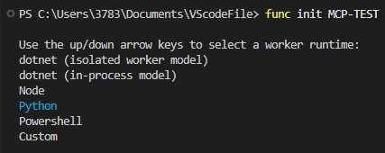
- 作成されたフォルダを開き直す
- requirements.txt を使って環境作成（仮想環境使うならアクティブ化する）
- 中身確認：以下が自動で作られたはず
    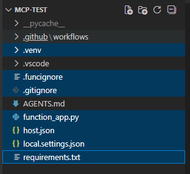

---

## host.json 修正
- `host.json` 元の状態
   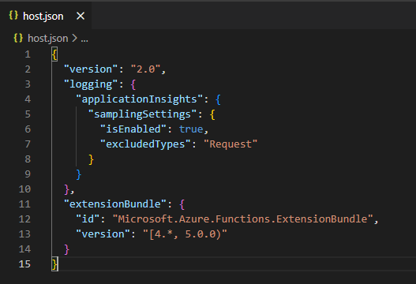 

- 修正： `Experimental` を追記
    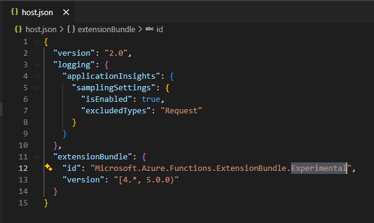 

---

## function_app.py 修正
- AIコーディングに指示
    **プロンプトの要点**
    ```
    ## 前提
    Azure functions のMCP拡張を使ってカスタムMCPサーバーを作成します。
    - Python v2 の FunctionApp を使い、各 MCP ツールは 1 関数 = 1 ツール として公開
    - 次の構文で MCP ツールを定義する：
        - @app.mcp_tool_trigger(arg_name="context", tool_name="...", description="...", tool_properties="...")
        - 例：
            ```
            # 疎通確認用のシンプルなMCPツール
            @app.mcp_tool_trigger(
                arg_name="context",
                tool_name="health_check",
                description="MCPサーバーの疎通確認",
                tool_properties="[]"
            )
            def health_check(context) -> str:
                """
                MCPサーバーの疎通確認用エンドポイント

                Returns:
                    str: ステータス情報のJSON文字列
                """
                try:
                    return json.dumps({
                        "status": "healthy",
                        "message": "MCPサーバーは正常に動作しています",
                        "service": "Azure AI Search Hybrid Search MCP Server",
                        "version": "1.0.0"
                    }, ensure_ascii=False)

                except Exception as e:
                    logger.error(f"ヘルスチェックエラー: {str(e)}")
                    return json.dumps({
                        "status": "error",
                        "message": str(e)
                    }, ensure_ascii=False)
            ```

    ## 要求機能（ツール）
    - 欲しい機能その１
    - 欲しい機能その２
    - ...
    ```

---

## Github登録
- 新しいリポジトリに登録しておく

---

## Azure Functions リソース作成
- `Functions` で検索
    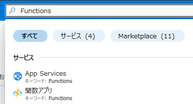
- `フレックス従量課金` を選択
     
- 設定を進む（説明は省略）
- ストレージには関連ファイルが保存される。既存のBlobストレージでもよいが、自分で分かり易い名前を付けることをおすすめ。
    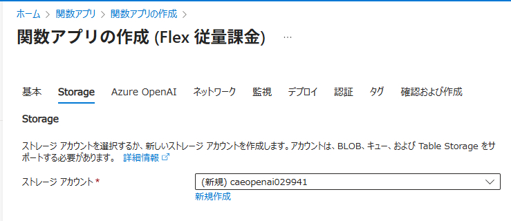 
- デプロイ設定はGithubを選択：新しく作成したリポジトリを指定
    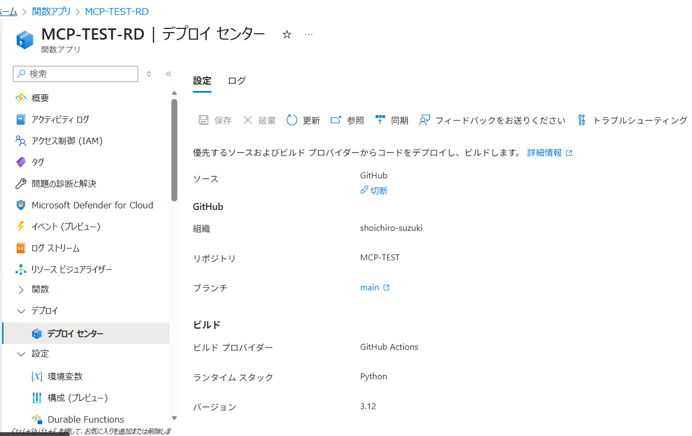 
- FunctionsにGithub連携した時点で自動的にデプロイが開始される。
    しかし、自動的に作成される設定ファイル（※）が原因で失敗する
    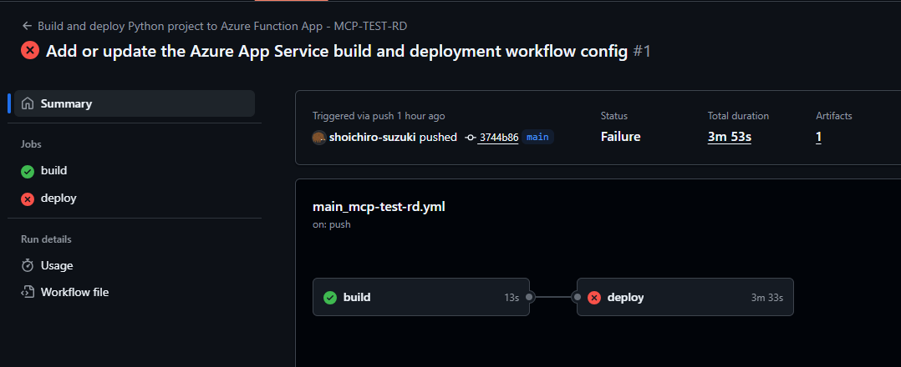 
    ※　自動デプロイのときに `.github/workflows` が作成される。
        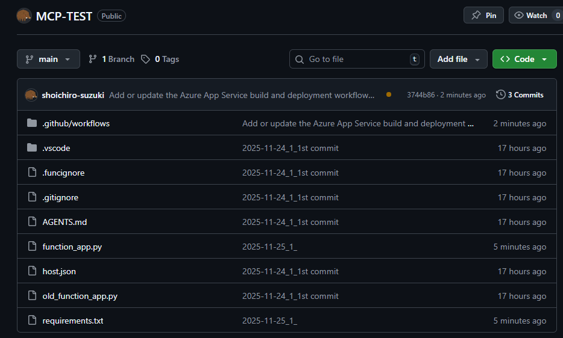 
- `.github/workflows` を直すために、VScodeに `fetch` する
    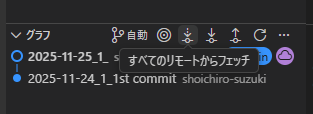 
- `.github/workflows` の中に `*.yml` があるので以下のように直す
    末尾に以下を追加
    ```yml
    sku: 'flexconsumption'
    remote-build: 'true'
    ```
    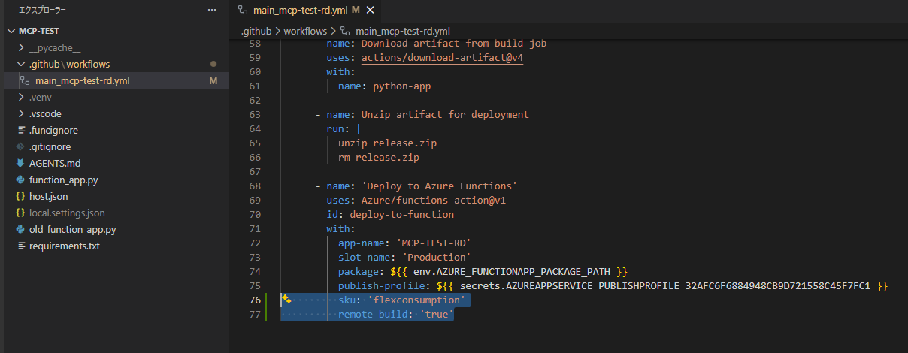 
- 変更をコミットしてGithubも更新＝自動的にAzure Functionも再デプロイ開始
    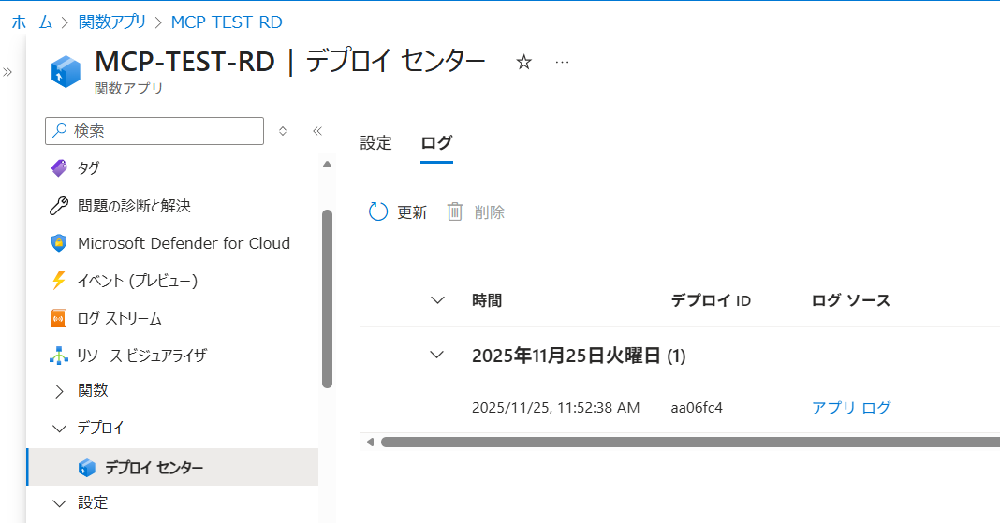 
- 成功して完了したところ
    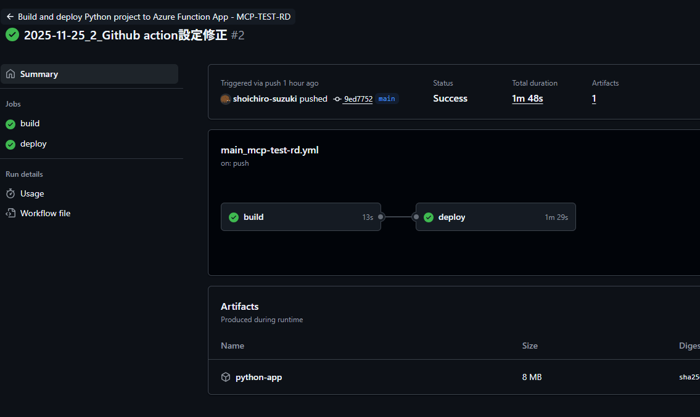 

## ClaudeにMCPを接続
> **注意**
> 　下記の接続方法は認証がなく、シークレットをURLに直接埋め込んだ **とりあえず接続できる** 方法です。
> 　接続URLがそのまま漏れると、部外者でもカスタムMCPに接続できます。
> 　認証込みの仕組みが確立するまでは、開発者＋信用できる範囲までの公開に留めてください。
> 　なお、Webアプリ化したシステムからFunctionsのMCPにつなぐ場合は、URLを環境変数で管理すれば問題ありません。


- Azureポータル＞Azure Functions＞概要＞既定のドメイン　をコピー
    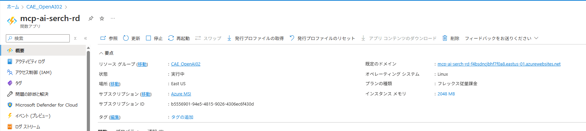 
- Azure Functions＞関数＞アプリキー＞mcp_extension　をコピー
    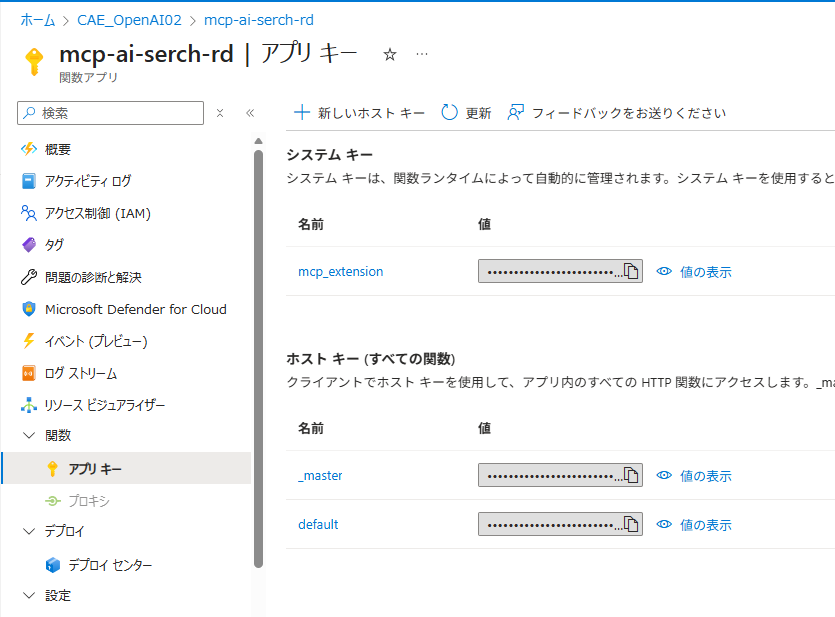 
- FunctionsのMCP拡張にアクセスするURLを作る
    ```
    https://<既定のドメイン>/runtime/webhooks/mcp/sse?code=<mcp_extensionの値>
    ```
- Claude＞設定＞コネクタ＞カスタムコネクタを追加
- コネクタの名前とURLを記入して追加
    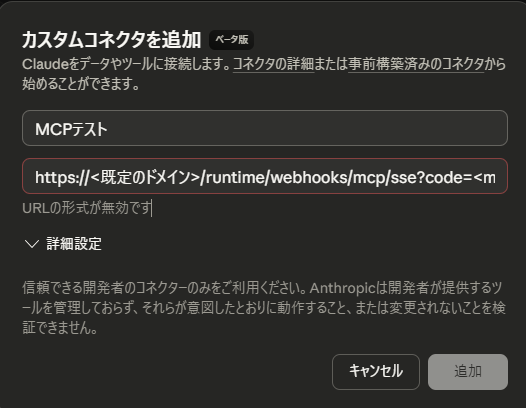 
- 接続成功を確認したら、新規チャットでコネクタを有効化
    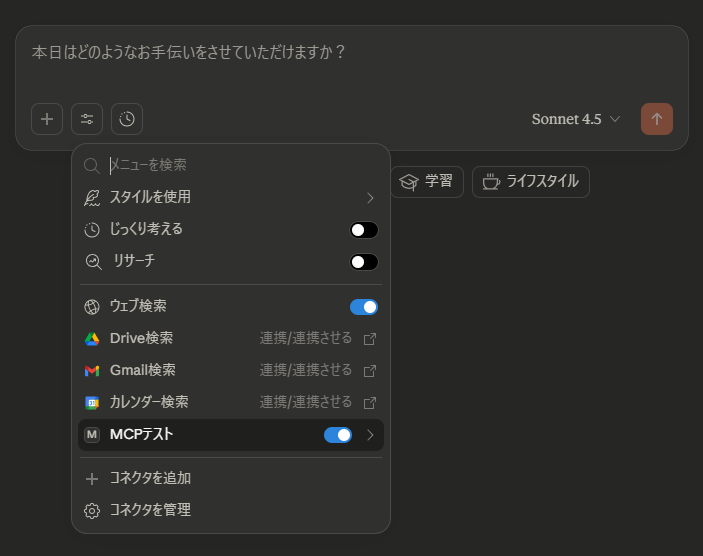 
- カスタムコネクタを使ってみた
     

### CtatGPTの場合
- ChatGPT＞設定＞アプリとコネクター＞一番下までスクロール＞高度な設定＞開発者モードをオン
- ChatGPT＞設定＞アプリとコネクター＞右上の`作成する`
- 名前、説明、URLを記入。認証は`認証なし`。リスクへの警告にチェックして作成。