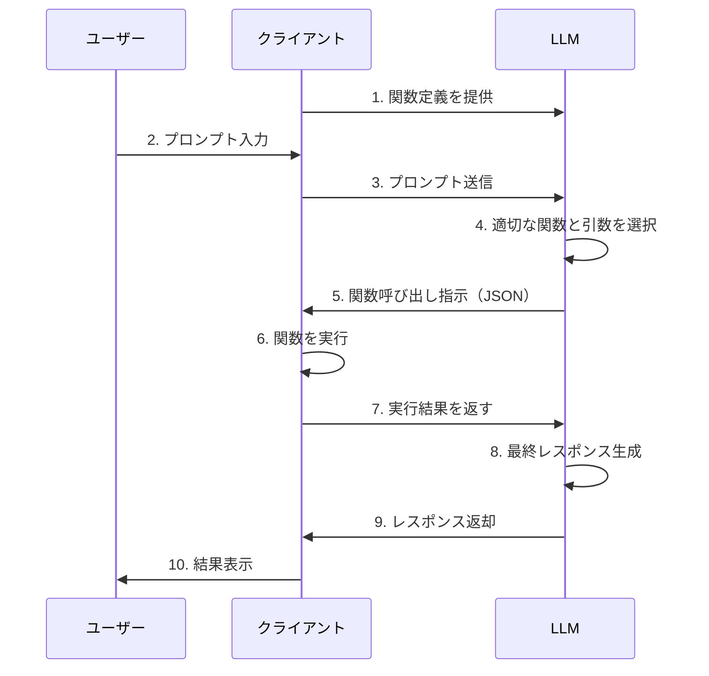

# 1. 概要

## 1.1 Function Callingとは

### 定義
- LLMが外部ツール・APIと連携する仕組み
- ユーザーの自然言語入力から関数呼び出しに必要な引数を自動生成
- テキスト生成を超えた実用的な機能の実現

### 重要な特徴
**LLMは関数を実行しない**
- LLMは関数の引数（JSONフォーマット）を生成するのみ
- 実際の関数実行はクライアント側で行う
- 実行結果をLLMにフィードバックして最終レスポンスを生成

### 仕組み

## 1.2 主な利用シーン

### データベースサーチ
- 自然言語でのデータベースクエリ
- SQLクエリの自動生成
- 条件指定による柔軟な検索

**例**：「2024年1月の売上が100万円以上の商品を教えて」
→ LLMが適切な検索条件を抽出し、DB検索関数の引数を生成

### 機械的な処理
- データ変換・フォーマット変換
- 計算処理の自動実行
- 構造化データの抽出

**例**：「この請求書PDFから必要な情報を抽出して」
→ LLMが抽出すべきフィールドを判断し、データ抽出関数を呼び出し

---

## 参考情報

### 基礎理解
- [【GPT】Function calling 最初の一歩 - Qiita](https://qiita.com/wing_man/items/788511a69b09ad3db4e3)
  - 初心者向けの丁寧な解説、2023年11月のAPI変更対応済み

- [OpenAI APIでFunction callingを使ってみる - Qiita](https://qiita.com/iconss/items/173101bca6e2b99f4151)
  - 「関数を実行してくれない」という重要なポイントを明確に解説

### 実用例
- [ChatGPT APIのFunction callingを使って、請求書の構造化データを抽出する - gihyo.jp](https://gihyo.jp/article/2023/07/programming-with-chatgpt-04)
  - 構造化データ抽出の実例

- [ChatGPT Function Callingとベクトル検索の組み合わせ - Qiita](https://qiita.com/kuromiya123/items/35f7dc522ecd988015b6)
  - データベース検索との連携例
