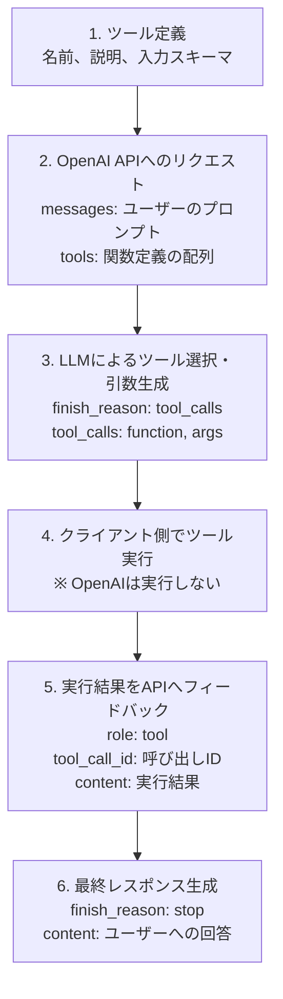

# 2. 技術仕様

## 2.1 基本的なワークフロー

### フロー図



### 重要ポイント
- **ステップ4がクライアント側の責任**：OpenAIは関数を実行しない
- **ステップ5で結果をフィードバック**：会話履歴に追加してAPI再呼び出し

## 2.2 ツール定義（JSON Schema）

### 従来型ツール（type: "function"）

```json
{
  "type": "function",
  "function": {
    "name": "関数名",
    "description": "関数の説明",
    "parameters": {
      "type": "object",
      "properties": {
        "パラメータ名": {
          "type": "データ型",
          "description": "パラメータの説明"
        }
      },
      "required": ["必須パラメータ名"]
    }
  }
}
```

### カスタムツール（type: "custom"、GPT-5以降）

GPT-5以降では、プレーンテキスト形式でツールを定義可能：

```json
{
  "type": "custom",
  "custom": {
    "name": "execute_sql",
    "description": "SQLクエリを実行してデータベースから情報を取得",
    "input_type": "text/sql"
  }
}
```

**カスタムツールのメリット**：
- Python、SQL、シェルコマンドなどをJSON化せずに直接送信
- 複雑なコードのエスケープが不要
- より自然な形式でツール呼び出しが可能

### 具体例：天気取得関数

```json
{
  "type": "function",
  "function": {
    "name": "get_current_weather",
    "description": "指定された場所の現在の天気を取得する",
    "parameters": {
      "type": "object",
      "properties": {
        "location": {
          "type": "string",
          "description": "都市名（例：東京、大阪）"
        },
        "unit": {
          "type": "string",
          "enum": ["celsius", "fahrenheit"],
          "description": "温度の単位"
        }
      },
      "required": ["location"]
    }
  }
}
```

### パラメータ設計のポイント
- **description が重要**：LLMがこれを読んで判断する
- **enum で選択肢を制限**：誤った値の生成を防ぐ
- **required で必須項目を指定**：確実に必要な情報を取得

## 2.3 APIリクエスト形式

### 基本的なリクエスト構造

```python
import openai

response = openai.ChatCompletion.create(
    model="gpt-5.1-instant",
    messages=[
        {"role": "system", "content": "あなたは親切なアシスタントです"},
        {"role": "user", "content": "東京の天気を教えて"}
    ],
    tools=[
        {
            "type": "function",
            "function": {
                "name": "get_weather",
                "description": "天気情報を取得",
                "parameters": {
                    "type": "object",
                    "properties": {
                        "location": {"type": "string", "description": "都市名"}
                    },
                    "required": ["location"]
                }
            }
        }
    ]
)
```

### tool_choice パラメータ

| 値 | 動作 |
|---|---|
| `"auto"` (デフォルト) | LLMが自動判断 |
| `"required"` | 必ず何かの関数を呼び出す |
| `"none"` | 関数を呼び出さない |
| `{"type": "function", "function": {"name": "関数名"}}` | 特定の関数を強制 |

#### 使用例1：自動判断（デフォルト）

```python
response = openai.ChatCompletion.create(
    model="gpt-5.1-instant",
    messages=[{"role": "user", "content": "東京の天気を教えて"}],
    tools=[...],
    tool_choice="auto"  # LLMが必要に応じて関数を呼び出す
)
```

#### 使用例2：必ず関数を呼び出す

```python
response = openai.ChatCompletion.create(
    model="gpt-5.1-instant",
    messages=[{"role": "user", "content": "東京の天気を教えて"}],
    tools=[...],
    tool_choice="required"  # 必ず何かの関数を呼び出す
)
```

#### 使用例3：特定の関数を強制

```python
response = openai.ChatCompletion.create(
    model="gpt-5.1-instant",
    messages=[{"role": "user", "content": "東京の天気を教えて"}],
    tools=[
        {"type": "function", "function": {"name": "get_weather", ...}},
        {"type": "function", "function": {"name": "get_news", ...}}
    ],
    tool_choice={
        "type": "function",
        "function": {"name": "get_weather"}  # get_weatherを強制
    }
)
```

#### 使用例4：関数を呼び出さない

```python
response = openai.ChatCompletion.create(
    model="gpt-5.1-instant",
    messages=[{"role": "user", "content": "こんにちは"}],
    tools=[...],
    tool_choice="none"  # 関数を呼び出さず、通常の会話のみ
)
```

### verbosity パラメータ（GPT-5以降）

レスポンスの詳細度を制御：

```python
response = openai.ChatCompletion.create(
    model="gpt-5.1-instant",
    messages=[{"role": "user", "content": "東京の天気を教えて"}],
    verbosity="low"  # 簡潔な回答
    # "low" | "medium"(デフォルト) | "high"
)
```

### reasoning_effort パラメータ（GPT-5.1-thinking）

推論の深さを制御：

```python
response = openai.ChatCompletion.create(
    model="gpt-5.1-thinking",
    messages=[{"role": "user", "content": "複雑な数学問題..."}],
    reasoning_effort="high"  # 深い推論
    # "minimal" | "low" | "medium"(デフォルト) | "high"
)
```

## 2.4 レスポンス形式

### 関数呼び出しが必要な場合

```json
{
  "id": "chatcmpl-abc123",
  "choices": [{
    "index": 0,
    "message": {
      "role": "assistant",
      "content": null,
      "tool_calls": [{
        "id": "call_xyz789",
        "type": "function",
        "function": {
          "name": "get_weather",
          "arguments": "{\"location\": \"東京\", \"unit\": \"celsius\"}"
        }
      }]
    },
    "finish_reason": "tool_calls"
  }]
}
```

### 結果のフィードバック形式

関数実行後、結果を会話履歴に追加：

```python
messages.extend([
    # LLMからのツール呼び出し
    {
        "role": "assistant",
        "content": None,
        "tool_calls": [{
            "id": "call_xyz789",
            "type": "function",
            "function": {
                "name": "get_weather",
                "arguments": "{\"location\": \"東京\"}"
            }
        }]
    },
    # 実行結果
    {
        "role": "tool",
        "tool_call_id": "call_xyz789",
        "name": "get_weather",
        "content": "{\"temperature\": 20, \"condition\": \"晴れ\"}"
    }
])
```

### 最終レスポンス

```json
{
  "choices": [{
    "message": {
      "role": "assistant",
      "content": "東京の現在の天気は晴れで、気温は20度です。"
    },
    "finish_reason": "stop"
  }]
}
```

---

## 補足：最新モデル情報（2025年版）

### GPT-5シリーズ（2025年8月）
- gpt-5, gpt-5-mini, gpt-5-nano
- 400Kトークンコンテキスト、カスタムツール対応
- ツール呼び出し精度96.7%（τ2-bench）

### GPT-5.1シリーズ（2025年11月、最新）
- gpt-5.1-instant：高速、会話的
- gpt-5.1-thinking：深い推論

**推奨モデル**: GPT-5.1-instant（最新機能・最高性能）

---

## 参考情報

### 公式ドキュメント
- [Function calling - OpenAI API](https://platform.openai.com/docs/guides/function-calling)
  - 公式の技術仕様

- [GPT-5 New Params and Tools - OpenAI Cookbook](https://cookbook.openai.com/examples/gpt-5/gpt-5_new_params_and_tools)
  - GPT-5のカスタムツール、新パラメータの実装例

- [OpenAI APIのFunction callingを速攻検証 - Qiita](https://qiita.com/yahayuta/items/1ccd261d65273c7c44ff)
  - Python実装での検証例

### JSON Schema
- [Understanding JSON Schema](https://json-schema.org/understanding-json-schema/)
  - JSON Schema公式ガイド

- [ChatGPT APIのFunction callingを使ってみる - Qiita](https://qiita.com/Simossyi/items/046c746f715b6a8b45bc)
  - スキーマ定義の具体例
